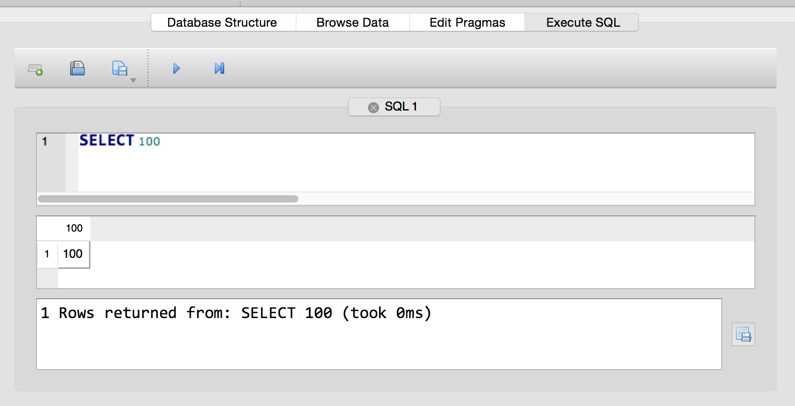
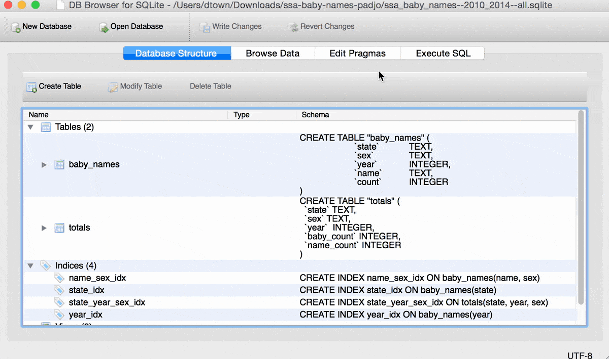

# The SELECT statement

You can guess what the __SELECT__ statement does: it's what we use to query the database for data. From the [SQLite documentation](https://www.sqlite.org/lang_select.html):

> The result of a SELECT is zero or more rows of data where each row has a fixed number of columns. A SELECT statement does not make any changes to the database.

There's not many kinds of __statements__ in SQL, and 95% of our queries will involve using the __SELECT__ statement. As a corollary -- if you read the excerpt above -- this means most what we generally do with SQL databases does _not_ alter the data, i.e. creating, updating, and deleting data.

Here's an animated GIF of the process:

